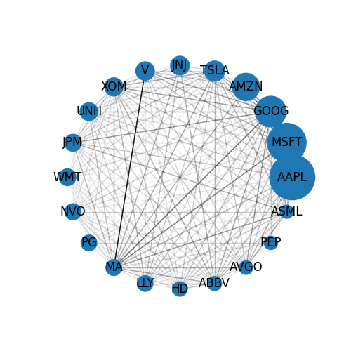
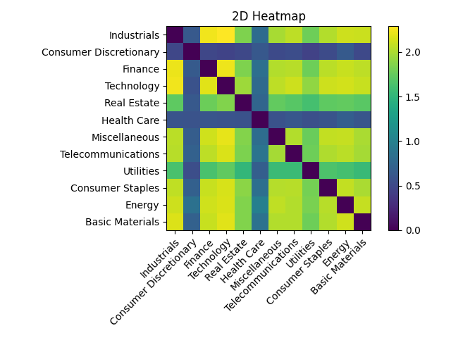

# Information Flow Among NASDAQ Stock Market With Transfer Entropy

The code implementation of HE7001Mathematical Economics

### Abstrast

The price fluctuation in stock market shares complicated non-linear relationships among different companies. From the perspective of information gain, transfer entropy captures the asymmetrical information flow within the stock market and many studies have been conducted to extract the relationships from a collection of market prices. However, most of them only focus on several companies instead of the whole sector. In this paper, we not only estimate the transfer entropy between different companies but also from the perspective of the whole sector, which contains less noise compared with a single company. Besides, due to the noise introduced at each time step in stock market price, the effectiveness of transfer entropy still remains unexplored. In this paper, we proposed two different experimental settings to validate the effectiveness of transfer entropy and show the information flow between different companies and sectors in the NASDAQ market. We also show the explanations of findings combined with the actual industry market.

### Results

Specifically, we use transfer entropy to measure information flow among top20 companies in NASDAQ:

and different sectors:

